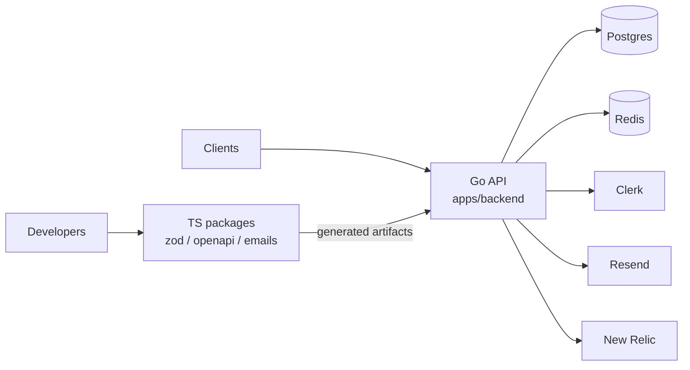
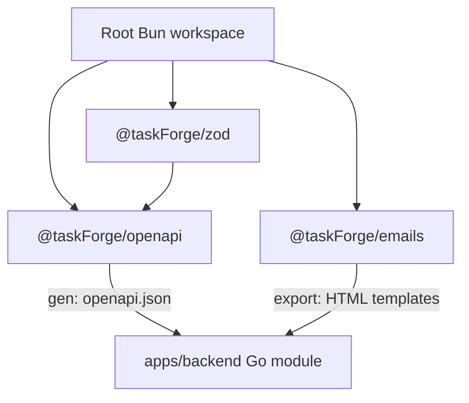
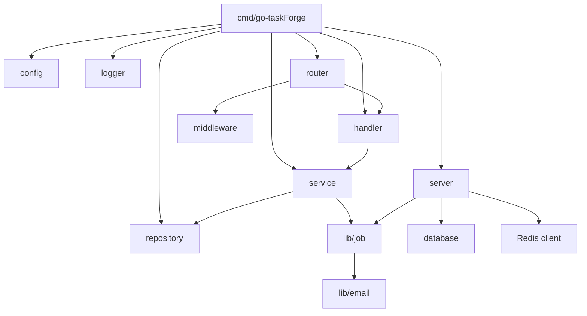
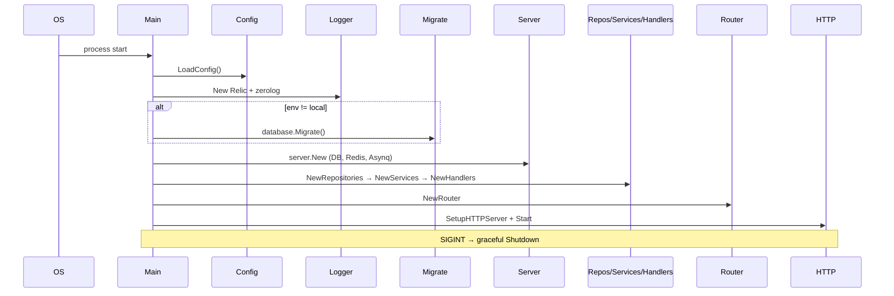
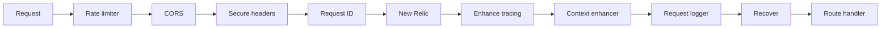
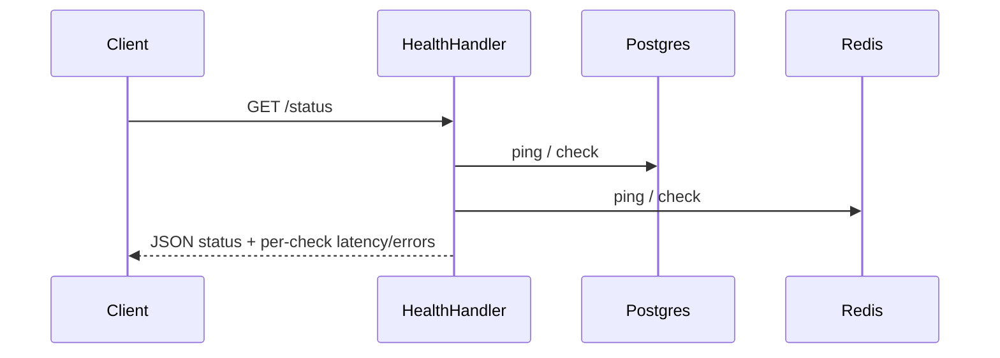
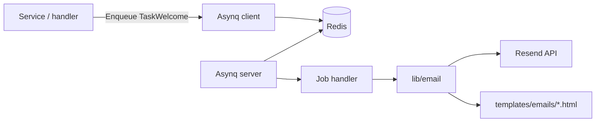
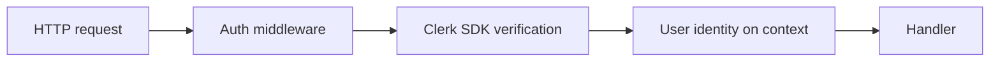

# Architecture

This document describes how the monorepo fits together, how a request moves through the Go API, and how shared TypeScript packages feed the backend.

## System context



## Monorepo package graph



| Artifact | Produced by | Consumed by |
| --- | --- | --- |
| Zod schemas / types | `packages/zod` | `packages/openapi`, future TS apps |
| `openapi.json` | `packages/openapi` (`bun run gen`) | `apps/backend/static`, `/docs` |
| Email HTML | `packages/emails` (`bun run export`) | `apps/backend/templates/emails` + Resend sender |

## Go backend layers

Code lives under `apps/backend/internal/` (internal by design — not importable from other modules).



| Package | Responsibility |
| --- | --- |
| `config` | Load/validate `BOILERPLATE_*` env into typed structs |
| `server` | Process composition root: DB, Redis, jobs, HTTP server |
| `database` | pgx pool + Tern migrator |
| `router` | Echo routes + global middleware registration |
| `middleware` | CORS, security headers, auth, rate limit, tracing, request ID, logging |
| `handler` | HTTP adapters (bind/validate → call services) |
| `service` | Business use cases |
| `repository` | Persistence boundary (scaffold today) |
| `lib/job` | Asynq client + workers |
| `lib/email` | Resend client + template rendering |
| `logger` | Zerolog + optional New Relic log forwarding |
| `errs` / `sqlerr` / `validation` | Cross-cutting error and input helpers |
| `testing` | Testcontainers and test utilities |

### Dependency rule

Prefer **inward** dependencies:

```text
handler → service → repository → database
                ↘ lib/job → lib/email
```

Handlers should not talk to the DB directly. Services orchestrate repositories and side effects (jobs, email).

## Application boot sequence



Important behaviors:

- **Local env** (`BOILERPLATE_PRIMARY.ENV=local`): skips automatic migrations (use `task migrations:up` when ready).
- **Non-local**: runs embedded Tern migrations before serving traffic.
- Redis ping failure is logged; the process can continue (jobs may still fail if Redis is down).
- Interrupt signal triggers graceful HTTP shutdown (default timeout 30s).

## HTTP middleware pipeline

Order matters. Current stack in `internal/router/router.go`:



System routes (`/status`, `/docs`, `/static`) are registered outside `/api/v1`. Versioned product APIs should hang off `router.Group("/api/v1")`.

## Health check data flow



Response shape is defined in TypeScript as `ZHealthResponse` (`packages/zod`) and mirrored in the OpenAPI contract (`GET /status`).

## Background jobs & email



1. Author templates in `packages/emails` (React Email).
2. `bun run export` writes HTML into `apps/backend/templates/emails`.
3. Go job handlers load those templates and send via Resend.

Queues are configured for priority bands (critical / default / low) inside `internal/lib/job`.

## Auth (Clerk)



`BOILERPLATE_AUTH.SECRET_KEY` is the Clerk secret used by `AuthService` / middleware. Protect `/api/v1` routes by attaching `RequireAuth` (or equivalent) when you add handlers.

## Observability

| Signal | Implementation |
| --- | --- |
| Logs | Zerolog (console or JSON) |
| Traces / APM | New Relic Go agent + Echo / pgx / Redis integrations |
| Health | `/status` + configurable checks list |

Set a real `BOILERPLATE_OBSERVABILITY.NEW_RELIC.LICENSE_KEY` in non-local environments. Without a valid key, APM features will no-op or fail to register depending on agent behavior — treat license configuration as required for production.

## Configuration model

```text
.env / process env
        │
        ▼
 godotenv (autoload) + koanf env provider (prefix BOILERPLATE_)
        │
        ▼
 config.Config (validated with go-playground/validator)
        │
        ├─► server / database / redis
        ├─► auth / integrations
        └─► observability
```

See [CONFIGURATION.md](CONFIGURATION.md) for the full variable list.

## Design goals

1. **Copy-paste productive** — clone, `bun install`, `task deps:up`, `task run`.
2. **Clear boundaries** — HTTP, domain, persistence, and side effects stay separable.
3. **Contract-first friendly** — schemas and OpenAPI live in TS; Go serves the generated doc.
4. **Production hooks early** — auth, jobs, email, APM, health, migrations are wired even if domain logic is thin.

## Non-goals (today)

- Full domain/CRUD sample app
- Multi-tenant tenancy model
- Kubernetes manifests / Terraform (add in your fork)
- A finished frontend (directory is reserved)
